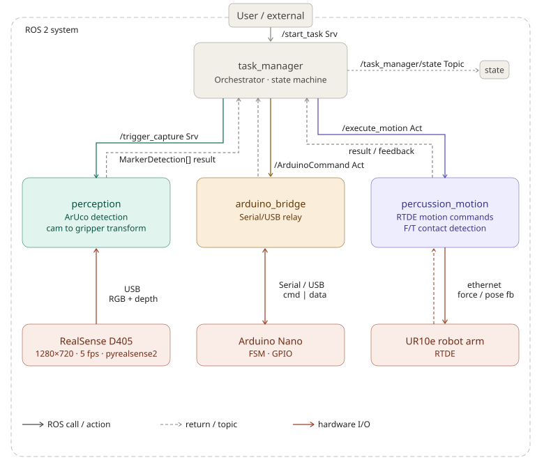
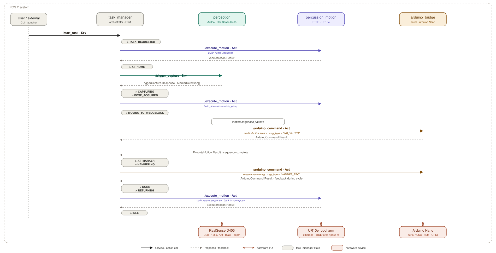

# Percussion Module — ROS 2 Workspace

ROS 2 (Jazzy) workspace for the percussion Module of the PERI UP Genio mobile platform system. 

1. The percussion module detects a wedgelock position based on ArUco markers via an Intel RealSense camera and moves to them with the ur10e robot arm via RTDE. 

2. robot arm moves towards the ledger in 1D until contact, Move tool upwards of ledger, repeat move until contact downwards. Move over ledger pin. Then move until contact in 3rd dimension. Wedgelock position is now known.

### To be implemented: 

3. Initiate `hammerTask`. Low-level controller performs hammer action (x number of strikes) then returns `HAMMER_FINISHED`. 


**Aditional features**:

- **Repeatable/more robust sequences**: No marker detected -> rotate camera to different position -> try again

- **Hammer top decks**: move tool to top position, potential inductive check. Hammer top deck into position (might require robot platform moving).

---

## Setup & Usage

### Dependencies

**System libraries** (install via apt):
```bash
sudo apt install librealsense2-dev librealsense2-utils
```

**ROS 2 packages** (install via apt):
```bash
sudo apt install ros-jazzy-ur ros-jazzy-ur-robot-driver ros-jazzy-tf2-ros
```

**Python packages** (install via pip):
```bash
pip install ur_rtde pyrealsense2 opencv-python numpy --break-system-packages
```


### 1. Start the UR robot driver

~~The `ur_robot_driver` must be running before launching this system. It is a separate ROS 2 stack and is **not** included in this workspace.~~
The `ur_robot_driver` is not currently used within this system.

**Real robot** (IP `169.254.0.22`, link-local):
```bash
ros2 launch ur_robot_driver ur_control.launch.py \
    ur_type:=ur10e robot_ip:=169.254.0.22 launch_rviz:=false
```

**Simulation (URSim):**

```bash
# Terminal 1 — start the simulated teach pendant
ros2 run ur_client_library start_ursim.sh -m ur10e
```

```bash
# Terminal 2 — start the driver (connects to URSim at 192.168.56.101)
ros2 launch ur_robot_driver ur_control.launch.py \
    ur_type:=ur10e robot_ip:=192.168.56.101 launch_rviz:=true
```


### 2. Launch the percussionModule task manager

```bash
ros2 launch percussion_task_manager task_system.launch.py
```

### 3. Trigger a task (system: 'start')

```bash
ros2 service call /percussion/task_manager/start_task percussion_interfaces/srv/StartTask "{mode: FIXING}"
```
or 
```bash
ros2 service call /percussion/task_manager/start_task percussion_interfaces/srv/StartTask "{mode: LOOSENING}"
```

---

## Architecture

The following diagram shows the architectural layout of the ROS project. The task manager node is a main orchestrator which decides the system state and what to do. The underlying nodes are called upon as needed;




The following diagram gives an overview of the general workflow of the program. When a task is requested this is the sequence in which things are executed. (not yet fully implemented)



Three nodes are started by the launch file, along with two static TF publishers (`world` -> `base_link` and `tool0` -> `camera_frame`).


| Node | Package | Role |
|---|---|---|
| `capture_service_node` | `percussion_perception` | Opens RealSense, detects ArUco markers, returns poses in gripper frame |
| `task_manager_node` | `percussion_task_manager` | Orchestrator state machine: calls perception then sends motion goal |
| `percussion_motion_node` | `percussion_motion` | Executes motion primitives on the UR10e via RTDE |
| `arduino_bridge_node` | `percussion_arduino_bridge`| Interfaces with arduino through serial communication and interacts with ROS through actions.  

**Custom interfaces** (`percussion_interfaces`): `msg/Pose6D`, `msg/MarkerDetection`, `srv/TriggerCapture`, `srv/StartTask`, `action/ExecuteMotion`, `action/ArduinoCommand`.

**State machine** (`task_manager_node`): 
`IDLE -> TASK_REQUESTED -> AT_HOME -> CAPTURING -> POSE_ACQUIRED -> MOVING_TO_WEDGELOCK -> AT_MARKER -> HAMMERING -> DONE -> RETURNING -> ERROR`

---

## TO DO

- update README/docs

### Currently known issues

- **Motion**:
 - ~~inverse kinematics issues with loosening mode (multiple theoretical joint~~ solutions, only 1 practical solution)

- **Arduino Command**:
  - ~~Number of hits not being passed to arduino~~
  - Properly pass arduino feedback to ROS log
  


- **Marker selection**: always picks `detections[0]`. Should be replaced with more intelligent decision making. (Wedgelock memory?)


- **Shutdown warning**: all three nodes emit `rcl_shutdown already called` — deduplicate `rclpy.shutdown()` calls in launch.

### Features to add

- **Task manager**: 
  - Error Handling:
    - No Marker in view -> need to move to new home position
    - No camera / no robot -> Error, allow for reconnect attempt
    - No inductive detected -> Error, move to home pose OR safety stop
    - Force timeout (contact timeout) -> error with marker detection/movement
    - 

  - ~~Pause motion sequence to request inductive sensor (ArduinoCommand)~~
  - ~~publish "SystemState" topic with:~~
    - TaskState
    - Task Mode
    - Inductive states
    - robot Pose?
    - ...

- **Optimalisation / error handling**:
      - ~~Add timeout for camera. (Not connected == keeps waiting forever)~~
      - Better error handling for robot connection / reconnect automatically

- **Tool control**:
 - ~~Add inductive sensor readout/passthrough~~
 - Cleanup C++ code
 - ...

      

### Fixed 

- **Task manager**:
  - ~~launch parameters are not being passed downstream -> implement LaunchArgument~~
  - ~~`capture_timeout_sec` not being passed to service.~~ (capture timeout removed)
  - ̃~~Rework motion sequence building/handling~~

- **percussion_motion**: 
  - ~~The robot currently moves using rtde, but to the wrong position -- problem with marker pose transform camera -> TCP pose~~
  - ~~Implement `MOVE_HOME`~~
  - ~~Orientation facing marker isn't always correct -> compounding error on next positions.~~
  - ~~building of motion sequences is cumbersome. (Move to motion package?)~~
  - ~~MoveUntilContact has no parameter Force threshold --> build custom force detection function.~~  

- ~~**`capture_service_stub.py`**: should be removed.~~

- **Tool control**:
 - ~~ Write Arduino program for low level control ~~
 - ~~tool controller node~~
 - ~~Serial Communication / Arduino-ROS bridge~~
- **Move until contact while hammering**
      - ~~Implement move until contact: requires bridge between rtde, Arduino serial and ROS~~
- **Motion**:
      - ~~Add more freedom/parameters to motion sequence. (custom vel/acc, ...)~~