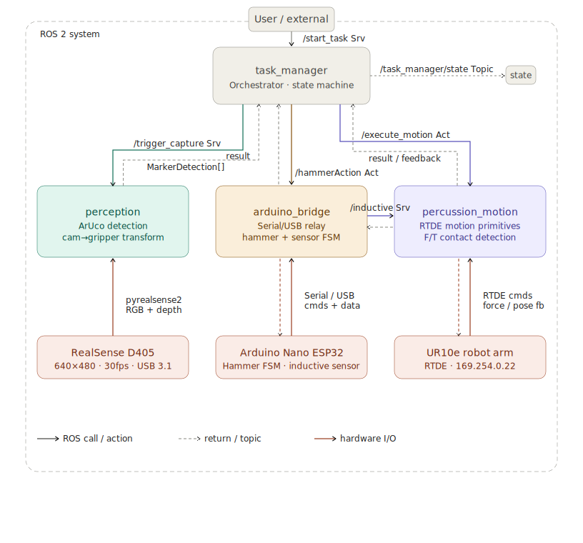
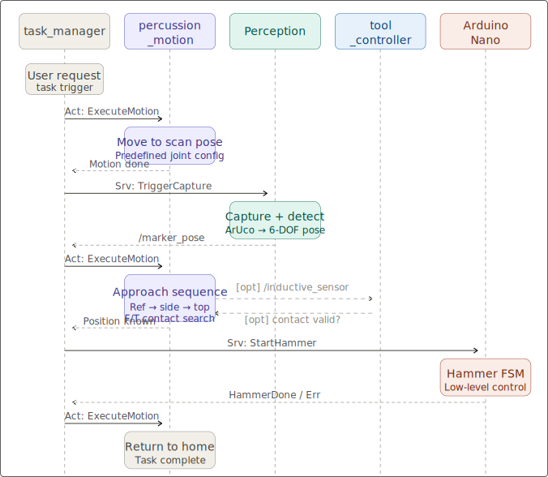

# [Percussion Module ROS Workspace](./percussionModule.md)

# Overview

Code for the percussion module master thesis.
The system uses a UR10e robot arm to locate construction elements via vision-based ArUco marker detection (Intel RealSense D405), executes a multi-step approach sequence, and triggers percussion via an Arduino-controlled hammer mechanism. The task manager orchestrates the `perception -> motion -> percussion` pipeline, ensuring repeatable, accurate hammering on predefined targets. 

**Key capabilities:**
- Real-time ArUco marker detection and 3D pose estimation
- Coordinated multi-step motion sequences (approach, contact, positioning, striking)
- Force-controlled contact moves for accurate alignment
- Generic serial command interface to Arduino percussion control
- Full state machine with error recovery and return-to-home

# Components

## ROS

The ROS workspace contains all the packages used for high-level control of the percussion module. Including packages for interfacing with lower level components and process management/logic. 

#### [`Task manager`](Task_Manager/task_manager.md)

#### [`Perception`](Perception/perception.md)

Makes use of:
- Intel realsense D405 camera
- OpenCV

#### [`Motion`](Motion/motion.md)

Makes use of:
- RTDE client library python interface

#### [`Arduino Bridge`](arduino_bridge/arduino_bridge.md)

Makes use of:
- PySerial

## Arduino

This section contains the C++/.ino code running on the low level controller (arduino nano microcontroller). It reads commands through serial and then performs the necessary low level actions. 

#### [`Arduino_toolController`](./Arduino_toolController/Arduino_toolController.md)

Makes use of:
 - Arduino nano ESP32

